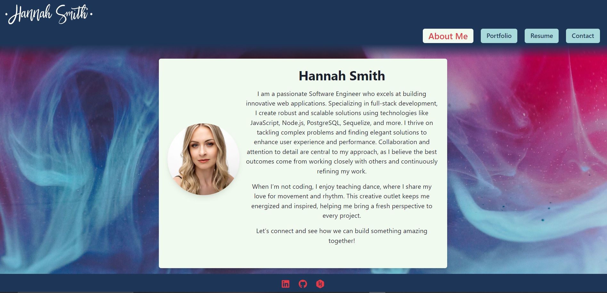

# HannahDevPortfolio

## Description
Welcome to HannahDevPortfolio, a showcase of my journey as a junior developer! This portfolio not only highlights my technical skills and projects but also reflects my passion for coding and continuous learning. Here, you will find an array of projects that demonstrate my capabilities in web development, including front-end and back-end technologies. Each project is crafted with attention to detail and a focus on user experience, aiming to inspire and connect with fellow developers and potential employers.

## Table of Contents
* [Installation](#installation)
* [Usage](#usage)
* [License](#license)
* [Contributing](#contributing)
* [Tests](#tests)
* [Credits](#credits)
* [Questions](#questions)

## Installation
npm i

## Usage
View the deployed application [here](https://hannahdevportfolio.netlify.app/).

This portfolio serves as a personal and professional showcase of my work. Feel free to navigate through the different sections to explore my projects, learn about my skills, and get in touch. Whether you are a potential collaborator, employer, or fellow developer, I hope you find my work inspiring and informative!

## License
This project is licensed under the MIT license. Please feel free to read the license in full detail [here](https://opensource.org/license/mit)

## Contributing
Please contact me regarding contributions to the repo.

## Tests
N/A

## Credits
Background Photo by <a href="https://unsplash.com/@ruvimnogaphoto?utm_content=creditCopyText&utm_medium=referral&utm_source=unsplash">Ruvim Noga</a> on <a href="https://unsplash.com/photos/blue-red-and-black-smoke-digital-wallpaper-pazM9TQJ2Ck?utm_content=creditCopyText&utm_medium=referral&utm_source=unsplash">Unsplash</a>

## Questions
Please contact me with any additional questions.

Github: hannahpsmith (https://github.com/hannahpsmith)

Email: hannahpsmith94@gmail.com
